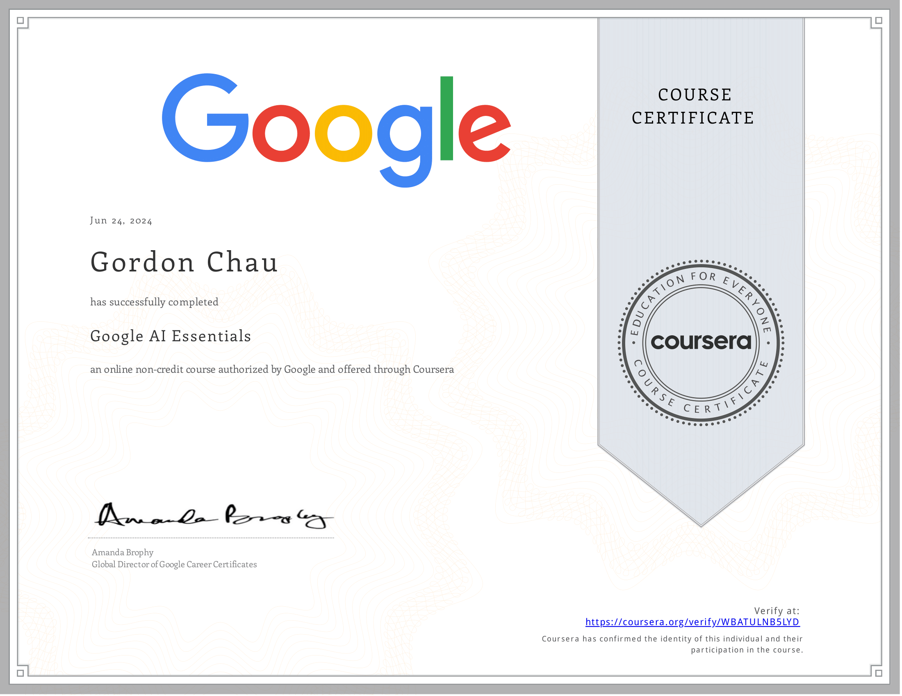
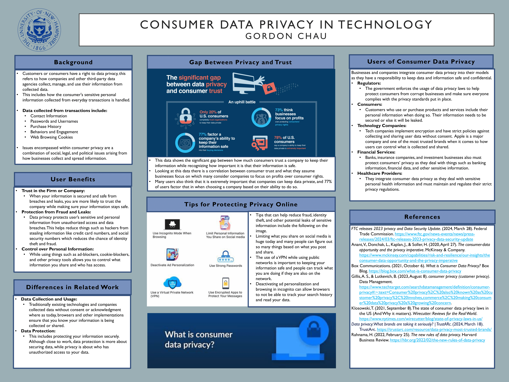
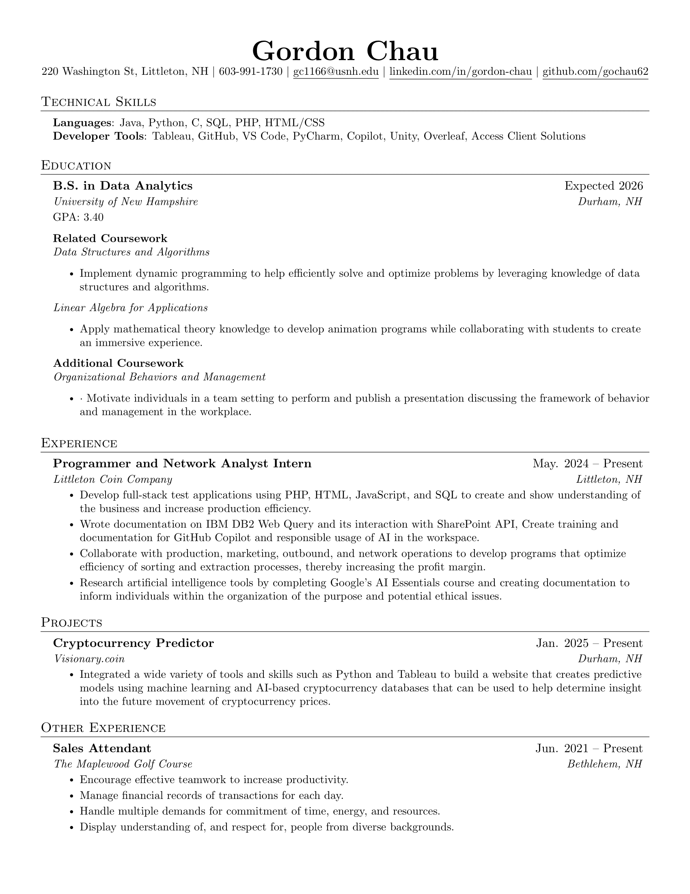

<h1 align="center">:godmode:  Gordon Chau  :trollface:</h1>
<h3 align="center">Data Analyst | Web Developer | Programmer and Network Analyst</h3>

  
  
  

---
### :shipit: Technical Skills  
#### **Languages**  
- `Java`, `Python`, `JavaScript`, `HTML`, `CSS`, `MySQL`, `PHP`, `Matlab`
#### **Frameworks & Tools**  
- `Tableau`, `TailwindCSS`, `Chart.js`, `Git`, `LaTeX`
- `numpy`, `pandas`, `polars`, `seaborn`,
- `beautifulsoup`, `unity`, `matplotlib`, `overleaf`, `Access client solutions`

---
### 🌟 Data Analytics rising Senior at the University of New Hampshire
- 🔧 **Programmer and Network Analyst** at [Littleton Coin Company](https://www.littletoncoin.com/shop)
- 🌐 **Project Lead Developer** for [Visionary.coin](https://www.linkedin.com/company/visionary-coin/?viewAsMember=true)

---
### 💻 Projects  
**Visionary.coin Crypto currency predictor**
- Integrated a wide variety of tools and skills, such as Python and Tableau, to build a website that creates predictive models using machine learning and AI-based cryptocurrency databases that can be used to help determine insight into the future movement of cryptocurrency prices.
- Applied machine learning techniques to support strategic cryptocurrency forecasting.
  
** PACE: Pupillometric Analysis of Cognitive Effort**
- Conducted pupillometric and behavioral analysis integrating Tobii Pro Glasses 3 eye-tracking data with PEBL cognitive tests (N-Back, BCST) to quantify cognitive effort across varying task difficulties.
- Developed Python-based data pipelines to clean, normalize, and visualize pupil diameter data, implementing baseline correction, validity filtering, and relative dilation calculations to extract meaningful cognitive metrics.
- Collaborated on the design of a standard operating procedure for consistent data collection and preprocessing, including baseline calibration, participant recording, and test synchronization protocols.

---
### :octocat:  I’m currently learning ...

  
  

---
### ⚡ Fun fact: ...
<h4>
  <stong>I am Google AI Essentials Certified check out my license from Coursera and I did research on ethical usage of Consumer Data Privacy in Technology </stong>
</h4>

---
### 📒 Resume

