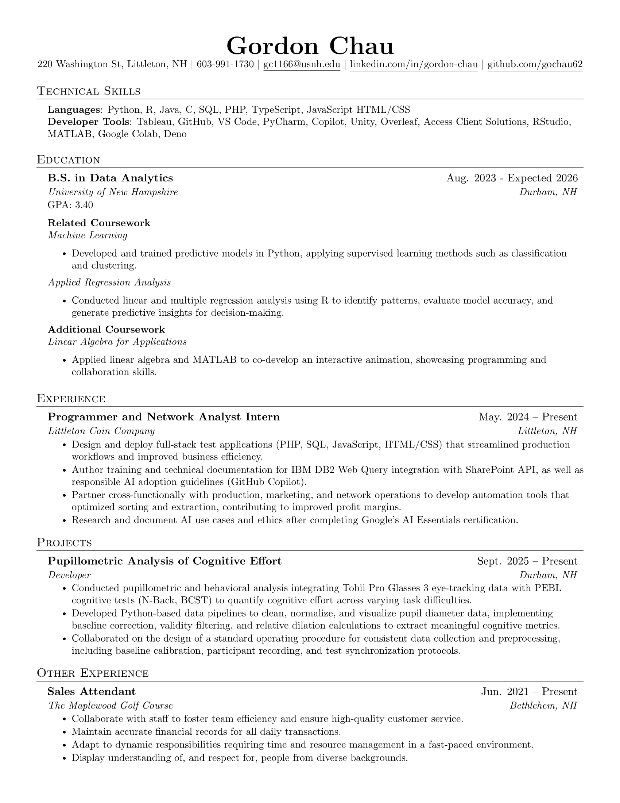

<h1 align="center">:godmode:  Gordon Chau  :trollface:</h1>
<h3 align="center">Data Analyst | Web Developer | Programmer and Network Analyst</h3>

  
  
  

---
### :shipit: Technical Skills  
#### **Languages**  
- `Java`, `Python`, `JavaScript`, `HTML`, `CSS`, `MySQL`, `PHP`, `Matlab`
#### **Frameworks & Tools**  
- `Tableau`, `TailwindCSS`, `Chart.js`, `Git`, `LaTeX`
- `numpy`, `pandas`, `polars`, `seaborn`,
- `beautifulsoup`, `unity`, `matplotlib`, `overleaf`, `Access client solutions`

---
### 🌟 Data Analytics rising Senior at the University of New Hampshire
- 🔧 **Programmer and Network Analyst** at [Littleton Coin Company](https://www.littletoncoin.com/shop)
- 🌐 **Project Lead Developer** for Visionary.coin
- 🏀  **March Madness Projections** for 2022 college basketball tournament

---
### 💻 Projects  
**Visionary.coin crypto currency predictor**
- Integrated a wide variety of tools and skills, such as Python and Tableau, to build a website that creates predictive models using machine learning and AI-based cryptocurrency databases that can be used to help determine insight into the future movement of cryptocurrency prices.

---
### :octocat:  I’m currently learning ...

  
  

---
### ⚡ Fun fact: ...
#### I am Google AI Essentials Certified check out my license from Coursera

#### I did research on ethical usage of Consumer Data Privacy in Technology

---
### 📒 Resume

